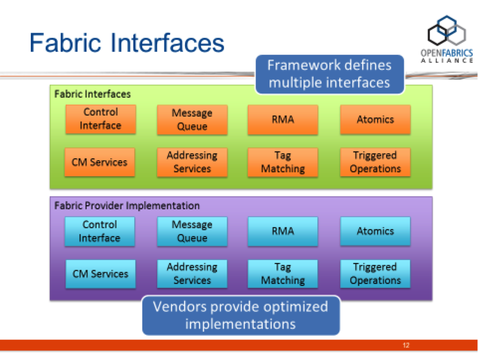



OpenFabrics Interfaces (OFI) is a framework focused on exporting fabric communication services to applications.  OFI is best described as a collection of libraries and applications used to export fabric services.  The key components of OFI are: application interfaces, provider libraries, kernel services, daemons, and test applications. 

Libfabric is a core component of OFI.  It is the library that defines and exports the user-space API of OFI, and is typically the only software that applications deal with directly.  It works in conjunction with provider libraries, which are often integrated directly into libfabric.

Libfabric has the following objectives:

Libfabric is being developed by the OFI Working Group (OFIWG, pronounced "ofee-wig"), a subgroup of the [OpenFabrics Alliance](http://www.openfabrics.org/).

Participation in the OFIWG is open to anyone.

The charter of the OFIWG is:

> Develop an extensible, open source framework and interfaces aligned with upper-layer protocols and application needs for high-performance fabric services.

The goal of OFI, and libfabric specifically, is to define interfaces that enable a tight semantic map between applications and underlying fabric services.  Specifically, libfabric software interfaces have been co-designed with fabric hardware providers and application developers, with a focus on the needs of HPC users.  Libfabric supports multiple interface semantics, is fabric and hardware implementation agnostic, and leverages and expands the existing RDMA open source community.  A high-level view of the libfabric architecture is shown below.

Libfabric is designed to minimize the impedance mismatch between applications, including middleware such as MPI, SHMEM, and PGAS, and fabric communication hardware.  Its interfaces target high-bandwidth, low-latency NICs, with a goal to scale to tens of thousands of nodes.

Libfabric targets support for the Linux operating system.  A reasonable effort is made to support all major, modern Linux distributions; however, validation is limited to the most recent 2-3 releases of RedHat Enterprise Linux (RHEL)and SUSE Linux Enterprise Server (SLES).  Libfabric aligns its supported distributions with the most current OpenFabrics Enterprise Distribution (OFED) software releases.  With the exception of the sockets provider, which is provided for development purposes, distro support for a specific provider is vendor specific.

Overview of libfabric
=====================

The following document provides an introduction to the libfabric architecture.

<iframe src="https://www.slideshare.net/slideshow/embed_code/key/arAPmHHuShNbde" width="476" height="400" frameborder="0" marginwidth="0" marginheight="0" scrolling="no"></iframe>

The following presentation describes some of the motivation for OFI and an earlyview of the libfabric architecture.

<iframe src="//www.slideshare.net/slideshow/embed_code/41653017" width="476" height="400" frameborder="0" marginwidth="0" marginheight="0" scrolling="no"></iframe>

The next presentation highlights some of the low-level details of the libfabric interface

<iframe src="https://www.slideshare.net/slideshow/embed_code/key/NbCh89SSIbKQ0U" width="476" height="400" frameborder="0" marginwidth="0" marginheight="0" scrolling="no"></iframe>

The [following presentation](https://www.slideshare.net/dgoodell/ofi-libfabric-tutorial)
is a tutorial that was presented at the SC15 conference in November 2015.

  <iframe src="https://www.slideshare.net/slideshow/embed_code/key/p0nI8BbOoDdSzj" width="476" height="400" frameborder="0" marginwidth="0" marginheight="0" scrolling="no" allowfullscreen></iframe>

How do I get involved?
======================

First, read the documentation:

* [Man pages for v1.2.0](v1.2.0/man/)
  * Older: [Man pages for v1.1.1](v1.1.1/man/)
  * Older: [Man pages for v1.1.0](v1.1.0/man/)
  * Older: [Man pages for v1.0.0](v1.0.0/man/)
* [Man pages for current head of development](master/man/)

A set of Linux man pages have been carefully written to specify the libfabric API.  Read through these man pages to get a sense of the libfabric API.  A [set of example applications](https://github.com/ofiwg/fabtests) have been developed to highlight how an application might use various aspects of libfabric.

Second, download the latest releases:

* The libfabric library itself (including documentation): [libfabric-1.2.0.tar.bz2](http://downloads.openfabrics.org/downloads/ofi/libfabric-1.2.0.tar.bz2) (or [see all prior releases](http://downloads.openfabrics.org/downloads/ofi/))
* Examples and unit tests: [fabtests-1.2.0.tar.bz2](http://downloads.openfabrics.org/downloads/ofi/fabtests-1.2.0.tar.bz2) (or [see all prior releases](http://downloads.openfabrics.org/downloads/ofi/))

The bulk of the libfabric code base is being developed in [the main OFIWG libfabric GitHub repository](https://github.com/ofiwg/libfabric).

Third: [become part of the conversation](http://lists.openfabrics.org/mailman/listinfo/ofiwg)

[Join the ofiwg mailing list](http://lists.openfabrics.org/mailman/listinfo/ofiwg).  Notices of the every-other-Tuesday OFIWG Webexes are sent on this list; anyone can join the calls to listen and participate in the design of libfabric.

Although OFI targets Linux as its primary operating system, portability for non-Linux platforms is provided as a convenience to our development community.  Currently, OFI has been ported to OS X.
