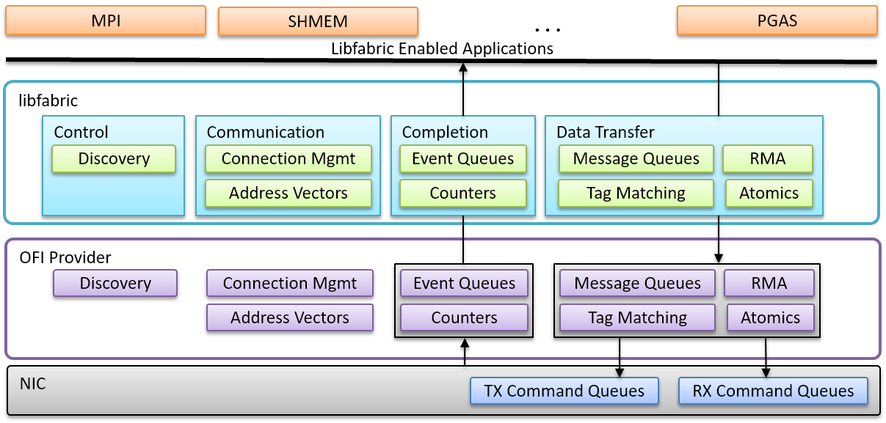



Latest releases
===============

* The libfabric library itself (including documentation): [libfabric v1.5.0](https://github.com/ofiwg/libfabric/releases/tag/v1.5.0) (or [see all prior releases](https://github.com/ofiwg/libfabric/releases/)).
* Examples and unit tests: [fabtests v1.5.0](https://github.com/ofiwg/fabtests/releases/tag/v1.5.0) (or [see all prior releases](https://github.com/ofiwg/fabtests/releases/)).

Overview
========

OpenFabrics Interfaces (OFI) is a framework focused on exporting fabric communication services to applications.  OFI is best described as a collection of libraries and applications used to export fabric services.  The key components of OFI are: application interfaces, provider libraries, kernel services, daemons, and test applications. 

Libfabric is a core component of OFI.  It is the library that defines and exports the user-space API of OFI, and is typically the only software that applications deal with directly.  It works in conjunction with provider libraries, which are often integrated directly into libfabric.

Libfabric is being developed by the OFI Working Group (OFIWG, pronounced "ofee-wig"), a subgroup of the [OpenFabrics Alliance - OFA](http://www.openfabrics.org/).  Participation in the OFIWG is open to anyone, and not restricted to only members of OFA.

The goal of OFI, and libfabric specifically, is to define interfaces that enable a tight semantic map between applications and underlying fabric services.  Specifically, libfabric software interfaces have been co-designed with fabric hardware providers and application developers, with a focus on the needs of HPC users.  Libfabric supports multiple interface semantics, is fabric and hardware implementation agnostic, and leverages and expands the existing RDMA open source community.

Libfabric is designed to minimize the impedance mismatch between applications, including middleware such as MPI, SHMEM, and PGAS, and fabric communication hardware.  Its interfaces target high-bandwidth, low-latency NICs, with a goal to scale to tens of thousands of nodes.

Libfabric targets support for the Linux, Free BSD, Windows, and OS X.  A reasonable effort is made to support all major, modern Linux distributions; however, validation is limited to the most recent 2-3 releases of Red Hat Enterprise Linux (RHEL)and SUSE Linux Enterprise Server (SLES).  Libfabric aligns its supported distributions with the most current OpenFabrics Enterprise Distribution (OFED) software releases.  Support for a particular operating system version or distribution is vendor specific.  The exceptions are the tcp and udp based socket providers are available on all platforms.

Developer Resources
===================

A comprehensive developer's guide is being developed.  Some sections are incomplete, still it contains substantial content on the architecture, design motivations, and discussions for using the API.

* [Developer Guide](https://github.com/ofiwg/ofi-guide/blob/master/OFIGuide.md)

A set of man pages have been carefully written to specify the libfabric API.

* [Man pages for v1.5.0](v1.5.0/man/)
  * Older: [Man pages for v1.4.2](v1.4.2/man/)
  * Older: [Man pages for v1.4.1](v1.4.1/man/)
  * Older: [Man pages for v1.4.0](v1.4.0/man/)
  * Older: [Man pages for v1.3.0](v1.3.0/man/)
  * Older: [Man pages for v1.2.0](v1.2.0/man/)
  * Older: [Man pages for v1.1.1](v1.1.1/man/)
  * Older: [Man pages for v1.1.0](v1.1.0/man/)
  * Older: [Man pages for v1.0.0](v1.0.0/man/)
* [Man pages for current head of development](master/man/)

[Set of example applications](https://github.com/ofiwg/fabtests) - highlight how an application might use various aspects of libfabric.

Additionally, developers may find the documents listed below useful in understanding the libfabric architecture and objectives in more detail.

* [A Short Introduction to the libfabric Architecture](https://www.slideshare.net/seanhefty/ofi-overview) - recommended for anyone new to libfabric.
* [Developer Tutorial - from HOTI '17](https://www.slideshare.net/seanhefty/2017-ofihotitutorial) - walks through design guidelines, architecture, followed by middleware use cases (PGAS and MPICH)
* [Developer Tutorial - from SC '15](https://www.slideshare.net/dgoodell/ofi-libfabric-tutorial) - walks through low-level interface details, followed by examples of application and middleware (MPI, SHMEM) using the APIs.
* [Starting Guide for Writing to libfabric](https://www.slideshare.net/JianxinXiong/getting-started-with-libfabric)

Open Collaboration
==================

The libfabric code base is being developed in [the main OFIWG libfabric GitHub repository](https://github.com/ofiwg/libfabric).  There are two mailing lists for OFIWG discussions:

* [The Libfabric users mailing list](http://lists.openfabrics.org/mailman/listinfo/libfabric-users) - intended for general user questions about the Libfabric library, to include questions from developers trying to use Libfabric in their applications.
* [The OFI working group mailing list](http://lists.openfabrics.org/mailman/listinfo/ofiwg) - used for the discussion and development of the OFI APIs themselves, and by extension, the continued development of the Libfabric library.

Notices of the every-other-Tuesday OFIWG Webexes are sent to the OFIWG mailing list.  Anyone can join the calls to listen and participate in the design of Libfabric.

